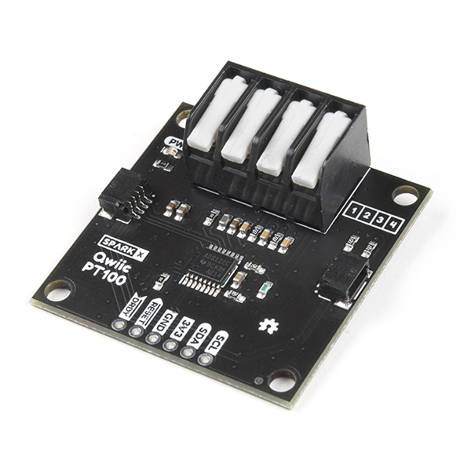

# introduction

The project was aiming at 3 targets:
- setup a seismic data collection system via single pair ethernet.
- collect seismic data from a geophone in view of training an earth quake detection AI model
- detect earthquakes at the Edge (think edgeAI)
But the lack of time (and earthquakes!) and help prevented the author to fullfill all the plans.
So only a proof of concept of sending seismic signal from a geophone via a Single Pair Ethernet is demonstrated.
Training an AI model for earthquake requires a significant amount of data, and in particular the data should be collected locally, that is at the site where detection is to be made (geographical location and location within a building, as non-earthquake related signals depends on e.g. the amount of nearby transportation traffic but also the terrain constitution) AND on the instruments used to collect the data.
This part of collecting and training an AI model couldn't be made within the imparted time: setting the system, testing it took most of the time from the date I've received the kit from sparkfun; and most importantly, no significant earthquake occured in my region (though a seismic active area of Earth:  Taiwan).

## Why Single pair ethernet (SPE)?

Right, why would we use SPE where simple cables could be used, or regular ethernet cables?
The signal from the geophone is meant to be used in two ways: earthquake detection at the edge (i.e. locally, on the MCU to which the instrument is connected, this is called at the edge) and is meant to be collected on a computer for either or both further processing and for further training. 
To be usefull, an earthquake detection system must provide early detection, before humans sense the danger. The signal to be detected is thus minute, and could be burried in noise. It is therefore essential that the signal be transmited with the highest possible fidelity, that is, with the least distortion and additional noise (phase noise, additive noise, multiplicative noise). A twisted pair is out of question. SPE does provide the necessary requirements and sufficient bandwith for a high resolution (up to 16bit) signal to be transmitted.
Geophones should be located as deep as possible in a building, and the low profile of the SPE cable allows a more convient cabling compared to regular ethernet.

Another advantage, not really relevant here but worth noting, is the cable weight reduction (2 pairs instead of 4 in regular ethernet cables).

Finally, and though it is not implemented in the function board provided by sparkfun (actually not implemented in the ADIN1110 itself) is the possibility to power the remote sensor via the cable, similar to PoE. This is much relevant in such a seismic system since the sensor can be located way down in basement or even in holes where regular electrical power would be difficult to install, and no renewable power could provide energy to the MCU+sensor.

# system

# TODO

see arduino to program with the SPE
Code for the geophone works, now need to link both boards and output something
See code:
https://learn.sparkfun.com/tutorials/micromod-single-pair-ethernet-function-board---adin1110-hookup-guide/all

for Tx (sends temp, pressure, ... data, as json)
https://github.com/sparkfun/SparkFun_ADIN1110_Arduino_Library/blob/main/examples/Example03a_TransmitStrBME280/Example03a_TransmitStrBME280.ino
for Rx: receives the data
https://github.com/sparkfun/SparkFun_ADIN1110_Arduino_Library/blob/main/examples/Example03b_RxStrSerLCD/Example03b_RxStrSerLCD.ino

# in PIO

The programing and uploading go fine but can't connect to the board.
The board seem to return an extra character, not present when it is programmed with the arduino IDE.

This is what is output, even if the code doesn't call any adin1110 related functions (ex, only the ADC)
(see the strange `�` character...)

    �Single Pair Ethernet - Example 1a Basic Send and Recieve
    Failed to connect to ADIN1110 MACPHY. Make sure board is connected and pins are defined for target.

Checl pin definition?

The exact same code with arduino and serial monitor (both the arduino IDE one and PIO device monitor) shows the board connects.

So use arduino ide to program the boards, can be monitored from platformIO though.

# SM-24 geophone

https://www.sparkfun.com/products/11744

How to...

Planning on using the PT100 with high resolution ADC

https://www.sparkfun.com/products/retired/16770

https://github.com/sparkfun/SparkFun_ADS122C04_ADC_Arduino_Library

https://github.com/sparkfun/SparkFun_ADS122C04_ADC_Arduino_Library/tree/main/examples/Qwiic_PT100_ADS122C04

## must check, info on connection

https://core-electronics.com.au/guides/geophone-raspberry-pi/

Using multiple geophones
https://forum.arduino.cc/t/seismic-data-logger-using-arduino-uno-and-ads1115/683065

## Other info:

https://www.instructables.com/SM24-Geophone-With-Raspberry-Pi-Pico-W/

https://acsoft.co.uk/accelerometers-geophones-and-seismometers-which-to-choose/

protocentral
https://www.hackster.io/team-protocentral/measuring-seismic-activity-using-protocentral-openpressure-702324
https://github.com/Protocentral/openPressure/tree/master
https://github.com/Protocentral/Protocentral_ADS1220/issues/9

Arduino forum post:
With schematic on using an opamp to measure the geophone signal
https://forum.arduino.cc/t/arduino-geophone-application/182534/5

Github on using a geophone

https://github.com/olewolf/geophone

## ADC

https://www.sparkfun.com/products/retired/16770

### examples of ADC

https://github.com/sparkfun/SparkFun_ADS122C04_ADC_Arduino_Library/tree/main/examples/Qwiic_PT100_ADS122C04

### datasheet of ADC

https://cdn.sparkfun.com/assets/7/4/e/1/4/ads122c04_datasheet.pdf

### others

forum post on testing probe connection
https://forum.sparkfun.com/viewtopic.php?p=231735#p231735

schematic of board

https://cdn.sparkfun.com/assets/9/b/6/d/8/Qwiic_PT100-Schematic.pdf

