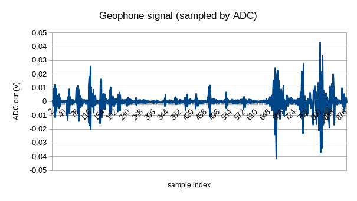
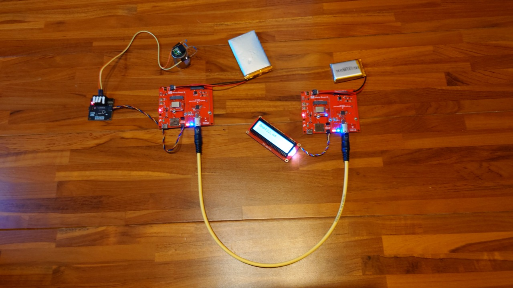
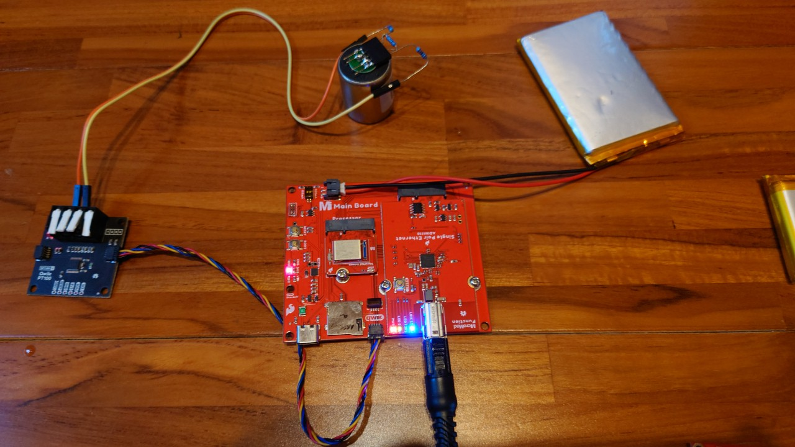
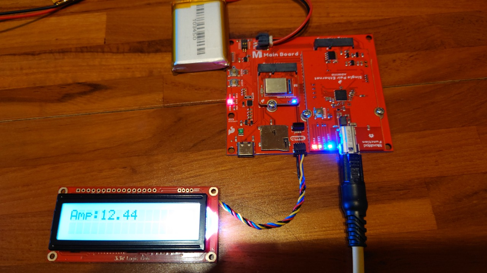

# Seismic data collection via single pair ethernet

## Introduction

This project aims at setting up seismic data collection system via single pair ethernet.

While it is submitted in its current state to the Sparkfun SPE Design Challenge, a more ambitous developpment is planned: 

- setup a seismic data collection system via single pair ethernet (done).
- collect seismic data from the geophone in view of training an earth quake early detection AI model (need earthquakes and time)
- detect earthquakes at the Edge and continuously capture new samples to improve detection rate and false positive and false negative detections.

Training an AI model for earthquake requires a significant amount of data, and in particular the data should be collected locally, that is at the site where detection is to be made (geographical location and location within a building, as non-earthquake related signals depends on e.g. the amount of nearby transportation traffic but also the terrain constitution) AND on the instruments used to collect the data.
This part of collecting and training an AI model couldn't be made within the imparted time: setting the system, testing it took most of the time from the date I've received the kit from sparkfun; and most importantly, no significant earthquake occured in my region (though a seismic active area of Earth).

## Why Single pair ethernet (SPE)?

Why would we use SPE where simple cables could be used, or regular ethernet cables?
In this project, the signal from the geophone is meant to be used in two ways: 
- earthquake detection at the edge (i.e. locally, on the MCU to which the instrument is connected, this is called at the edge)
- be collected on a computer for either or both further processing and for further training. 

To be usefull, an earthquake detection system must provide early detection, before humans sense the danger. The signal to be detected is thus minute, and could be burried in noise. It is therefore essential that the signal be transmited with the highest possible fidelity, that is, with the least distortion and additional noise (phase noise, additive noise, multiplicative noise). 
SPE provides the necessary requirements and sufficient bandwith for a high resolution (up to 16bit here) signal to be transmitted.
Geophones should be located as deep as possible in a building, and the low profile of the SPE cable allows a more convient cabling compared to regular ethernet cables and connectors.

Another advantage, not really relevant here but worth noting, is the cable weight reduction (2 pairs instead of 4 in regular ethernet cables).

Finally, and though it is not implemented in the function board provided by sparkfun (actually not implemented in the ADIN1110 itself) is the possibility to power the remote sensor via the SPE cable, similar to PoE. This is much relevant in such a seismic system since the sensor can be located way down in a basement or even in holes in the ground where regular electrical power could be difficult to install, and no renewable power could provide energy to the MCU+sensor.

## System

The whole system was built around components and modules from Sparkfun. The SPE kit was graciously provided by Sparkfun to participants to the challenge.

### components used

- [SparkX Qwiic PT100](https://www.sparkfun.com/products/retired/16770)
, based on the ADS122C04 24-bit ADC from TI.
- 3 1kOhm resistors
- [SM-24 geophone](https://www.sparkfun.com/products/11744)
- [SparkFun MicroMod Artemis Processor](https://www.sparkfun.com/products/16401)
- [SparkFun MicroMod Single Pair Ethernet Kit](https://www.sparkfun.com/products/retired/19628)
- LCD 

### geophone tests

The code used to test the geophone signal is in the GeophoneADC_test directory.
It is largely based on the [sparkfun library](https://github.com/sparkfun/SparkFun_ADS122C04_ADC_Arduino_Library) for the SparkX Qwicc PT100 board.

The graph below shows the output of the ADC connected to the transmitting part of the SPE setup.
The receiving part wasn't used here.
The triggering signal consisted in:
- sample indexes 0-270: moving away (with heavy steps) from the geophone placed on the desk
- sample indexes 271-618: coming back with light steps
- sample indexes 619-end: moving the surface of the table (that is, exerting an up and down force at a slow pace, as if lifting the desk, but not hitting it)

### Tremor detection

The lack of long (>10m) SPE cable and the absence of significant seismic activity since the beginning of the SPE design challenge in my area make that the system remains a proof of concept.

As it is, it detects tremors or shocks of an amplitude larger than an arbitrary threshold, and sends the corresponding amplitude (in milli volts) to the receiving part of the SPE system. 
A message is displayed on the LCD. 

The whole system in an autonomous (battery powered) configuration is shown on the photo below.

The transmitting part, with the geophone, ADC and SPE function board on a micromod single board (with artemis MCU):

And this is the receiving section, with the LCD, connected to the receiving SPE function board on a micromod single board (with artemis MCU):

## References

The following references were used or planned to be used.

https://learn.sparkfun.com/tutorials/micromod-single-pair-ethernet-function-board---adin1110-hookup-guide/all
https://github.com/sparkfun/SparkFun_ADS122C04_ADC_Arduino_Library
https://core-electronics.com.au/guides/geophone-raspberry-pi/
https://www.instructables.com/SM24-Geophone-With-Raspberry-Pi-Pico-W/
https://acsoft.co.uk/accelerometers-geophones-and-seismometers-which-to-choose/
https://www.hackster.io/team-protocentral/measuring-seismic-activity-using-protocentral-openpressure-702324
https://github.com/Protocentral/openPressure/tree/master
https://github.com/Protocentral/Protocentral_ADS1220/issues/9
https://forum.arduino.cc/t/arduino-geophone-application/182534/5
https://cdn.sparkfun.com/assets/7/4/e/1/4/ads122c04_datasheet.pdf
https://learn.sparkfun.com/tutorials/micromod-artemis-processor-board-hookup-guide

